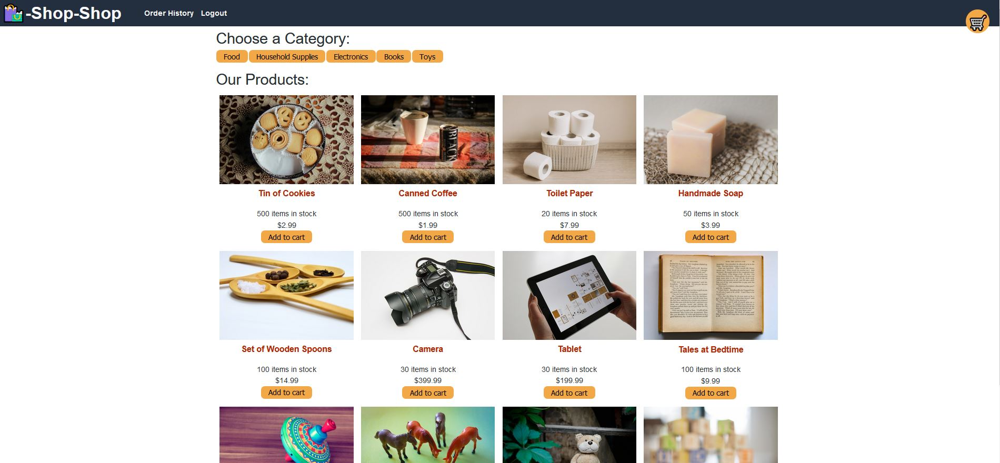
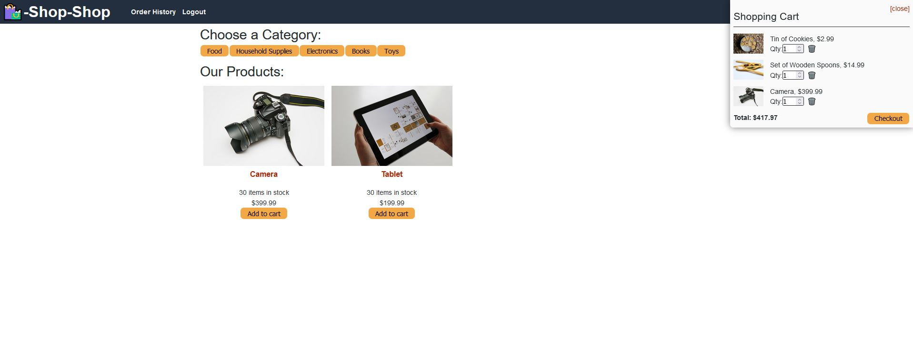
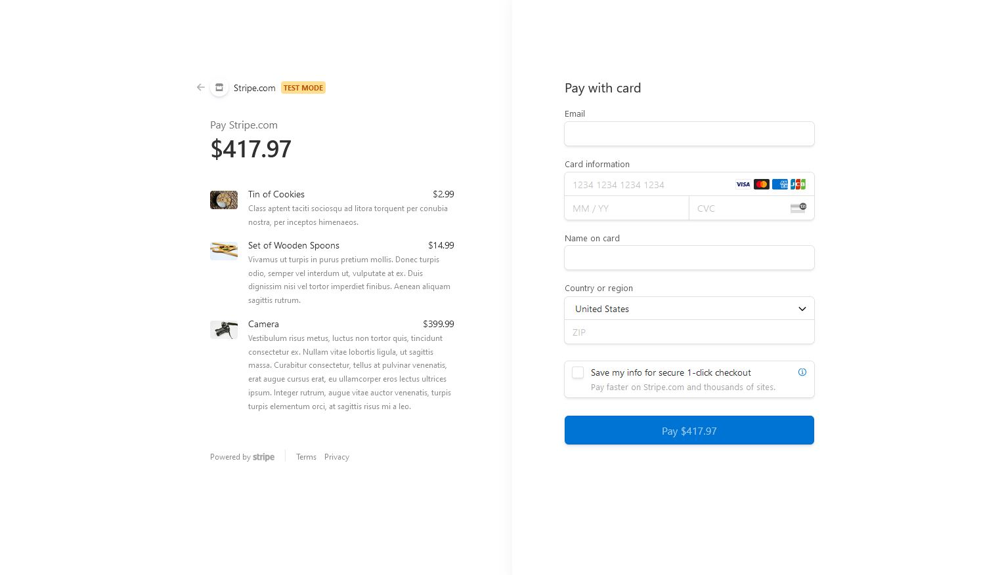
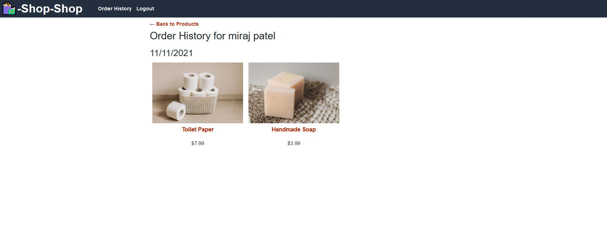

# shop-shop

## Description :
shop-shop is a MERN ( MongoDB, Express.js, React.js, Node.js) based Full Stack application. 
The application is using components and JSX in React for Front End client side while Node, Express and MongoDB database on server side. 
This application is built using global state, indexedDB for offline usage and stripe API for providing checkout option.

* The requirement from the client was as below:
```
As a user, I want to experience better performance across the features I use in the application:

 - View and filter products by category
 - Click on a product to see full details

As a user, I want to be able to add products to my shopping cart

As a user, I want to be able to see my shopping cart from any page

As a user, I want to be able to update or delete the quantity of shopping cart items

As a user, I want to be able to persist my current shopping cart items if I close the browser tab

As a user, I want to be able to view and add products to my shopping cart with or without a network connection

As a user, I would like to be able to use my credit card to process and complete my order

As a user, I want to see my order history
```

## Languages and other components used : 
```
   * npm (node package manager) 
   * React
   * React-router
   * Node.js
   * Express.js
   * MongoDB database
   * apollo-server
   * apollo-client
   * apollo-hook
   * graphQL
   * indexedDB
   * MongoDb Atlas
   * stripe API
   * Heroku App
   * github
```

## How to install : 

 To install the application in your computer follow the steps below: 

   Clone the repository in your computer :
    - open the command line and go to the directory where you want to clone the repository.
    - then clone the repo by typing : " git clone git@github.com:miraj00/shop-shop.git "

Here is a list of commands that were used while building this project :
```
- npm install
- npm run seed
- npm install mongoose
- npm install bcrypt --save
- mongod ( to start mongoDB server in initial phase )
- npm i apollo-server-express graphql
- npm run watch ( to run apollo server )
- npm install jsonwebtoken
- npx create-react-app client ( to setup react )
- npm start ( to start client server initially )
- npm i @apollo/cleint graphql
- npm install -D concurrently
- npm install react-router-dom
- npm install jwt-decode
- npm install @apollo/react-hooks
- heroku create
- git push heroku main
- heroku run npm run seed
- git add .
- git commit -m ________
- git push origin main
```

### How to Use the application : 

Once cloned locally and dependencies are installed, Run " npm run develop " command in command prompt to start both servers with a single command ( It should automatically open the browser and direct to http://localhost:3000/ ).  

## Below is the screenshot and Deployed application of the Project as per client request ## 






### Deployed Sites ##

[Please click here to see deployed code on Github](https://github.com/miraj00/shop-shop)

[Please click here to see deployed application on Heroku App](https://blooming-oasis-12948.herokuapp.com/)